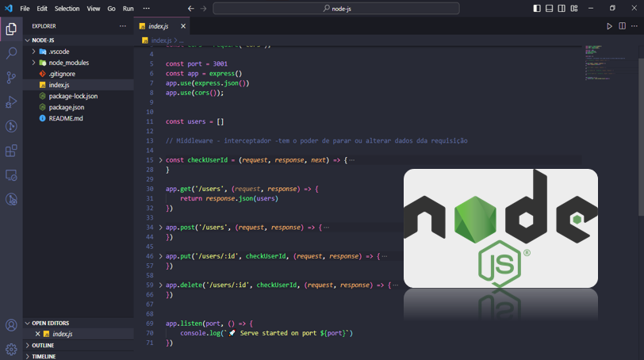

<h1>
Projeto Node.js: Cadastro de Nome e Idade
</h1>

Compartilho com entusiasmo meu projeto do curso DevClub: um sistema de cadastro de nome e idade em Node.js, utilizando o gerenciador de pacotes npm para garantir organização e confiabilidade.

<h2>
Tecnologias:
</h2>
<ul>
<li>Node.js</li>
<li>npm</li>
</ul>
<h2>
Funcionalidades:
</h2>
<ul>
<li>Cadastro de nome e idade </li>
<li>update e exclusão de contatos</li>
<li>Prevenção de entradas inválidas e dados inconsistentes</li>
<li>Mensagens de feedback claras e informativas</li>
</ul>
<h2>
O que aprendi:
</h2>
<ul>
<li>Conceitos básicos de Node.js e desenvolvimento back-end</li>
<li>Implementação de validação de dados</li>
<li>Controle de fluxo e tratamento de erros</li>
</ul>
<h2>
Contatos:
</h2>

>GitHub: https://github.com/DalioSY/node-js

>Linkedin: https://www.linkedin.com/in/dalio-s-yamada/

Se gostou dê uma curtida 👍. 

#devclub #nodejs #javascript #backend #desenvolvimentoweb #npm #cadastro #validacao #seguranca #github #node-js

